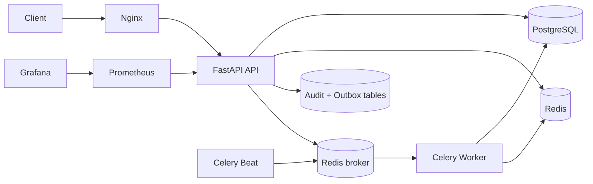

# Architecture

## System context

The application is a modular monolith. FastAPI owns synchronous HTTP APIs, PostgreSQL is the system of record, Redis provides caching/rate limiting and Celery transport, and Celery workers execute reminders, reports, analytics refreshes, and outbox delivery.

## Boundaries

- `app/api` registers versioned routers only.
- Each domain module owns schemas, repositories, services, routers, and models.
- Services control authorization and state transitions; repositories own database queries.
- Database changes are append-only Alembic revisions and must be applied before workers process new events.
- External provider calls happen outside database transactions.
- Outbox publication is at-least-once. Consumers must be idempotent using the outbox event ID.

## Production invariants

- PostgreSQL is mandatory in production; SQLite is for local tests only.
- Secrets come from the environment or a secret manager, never source control.
- Logs contain correlation IDs and operational metadata, not tokens, credentials, patient identifiers, clinical notes, or payment values.
- Redis and PostgreSQL are private network services; only Nginx/API observability endpoints are exposed intentionally.