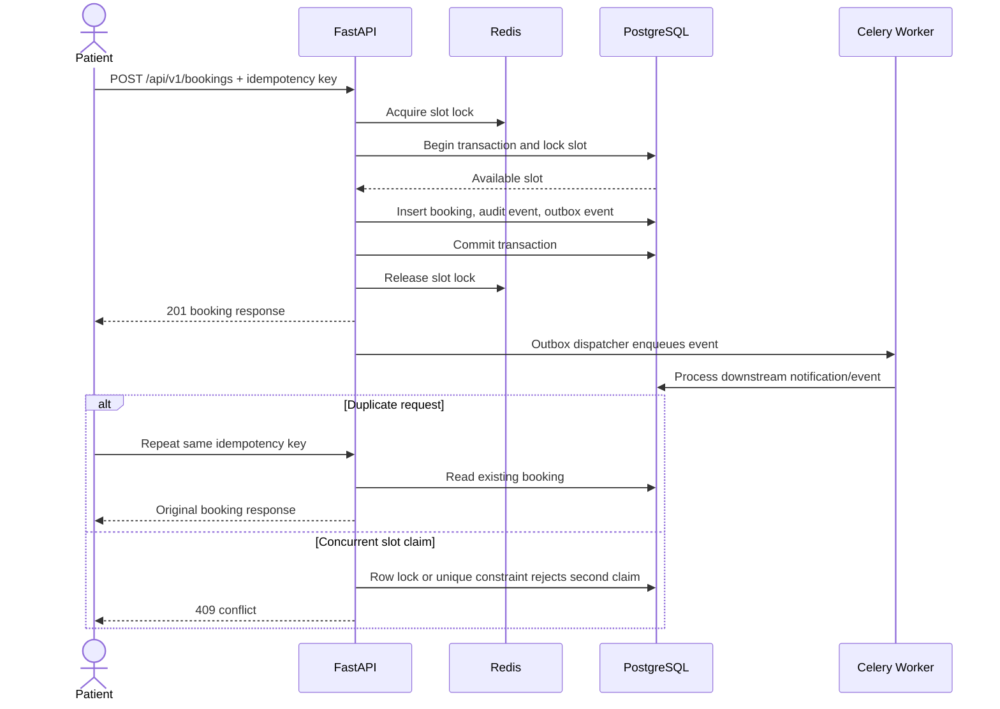

# Booking Sequence

Payment provider calls follow a separate rule: payment state is committed as `PROCESSING`, the provider is called with no open database transaction, and the final state plus audit/outbox event is committed afterward.