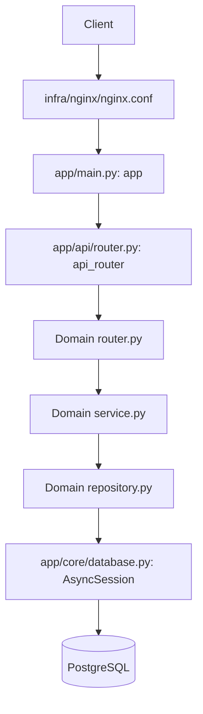
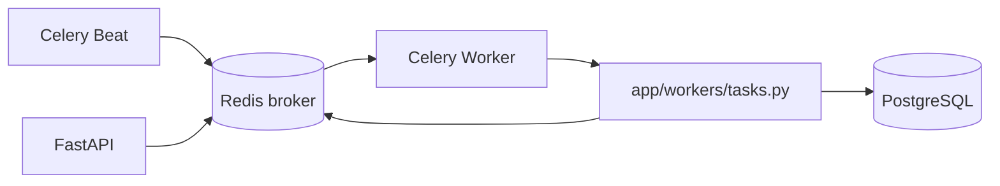

# Components

## Application entrypoints

- `app/main.py` creates the FastAPI instance `app`, registers middleware and exception handlers, and exposes `/health` and `/metrics`.
- `app/api/router.py` aggregates domain routers under `/api/v1`.
- `app/core/database.py` creates the async SQLAlchemy `engine` and `AsyncSessionLocal`.
- `app/workers/celery_app.py` creates `celery_app` and its beat schedule.
- `app/workers/tasks.py` contains the registered Celery tasks.

## Domain modules

Each populated domain module follows the same local structure: `models.py`, `schemas.py`, `repository.py`, `service.py`, and `router.py` where applicable.

| Module | Responsibility | Main service |
| --- | --- | --- |
| `auth` | Registration, login, refresh tokens, logout, MFA | `AuthService` |
| `users` | User model and profile lookup | None |
| `doctors` | Doctor profiles and availability slots | `DoctorService` |
| `bookings` | Booking lifecycle, locking, audit, outbox | `BookingService` |
| `consultations` | Consultation lifecycle and status transitions | `ConsultationService` |
| `prescriptions` | Prescription creation and retrieval | `PrescriptionService` |
| `payments` | Payment state, provider abstraction, finalization | `PaymentService` |
| `analytics` | Cached admin summary metrics | `AnalyticsService` |

`audit`, `availability`, and `search` directories exist but are currently empty.

## Request path

Services own state transitions and authorization checks. Repositories own SQLAlchemy query composition. Routers translate HTTP requests into service calls and commit successful mutations.

## Background path

The worker task names are:

- `app.workers.tasks.sample_background_task`
- `app.workers.tasks.send_notification`
- `app.workers.tasks.send_appointment_reminders`
- `app.workers.tasks.generate_daily_report`
- `app.workers.tasks.refresh_analytics_cache`
- `app.workers.tasks.process_outbox`
- `app.workers.tasks.deliver_outbox_event`

All are configured with retry/backoff behavior by `_retryable_task`.
