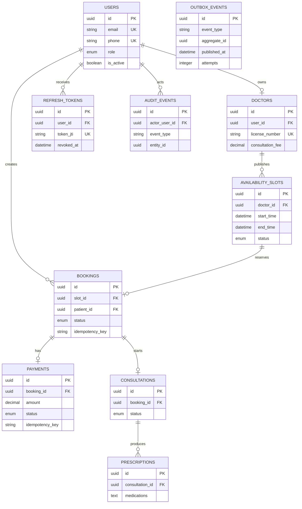

# Entity Relationship Diagram

The following diagram shows the core ownership and audit relationships. Audit and outbox aggregates are polymorphic by `entity_type`/`aggregate_type`, so they do not use database foreign keys to every domain table.

